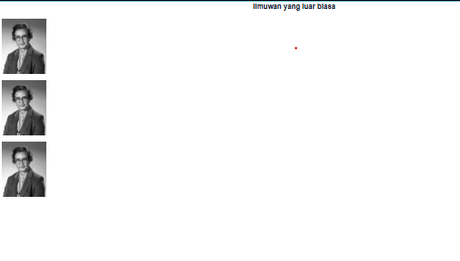

# Pemrograman Web Enterprise

## Modul 2 - Belajar Komponen React

### Soal 1 - Mendefinisikan Komponen

Pada praktikum ini saya membuat komponen `Profile` pada file `src/components/profile.tsx`. Komponen tersebut menggunakan `Image` dari Next.js untuk menampilkan gambar seorang ilmuwan.

Komponen `Profile` kemudian di-import ke dalam `src/app/page.tsx` dan digunakan sebanyak tiga kali pada halaman utama.

Dari praktikum ini saya mempelajari bahwa komponen React dapat dibuat secara terpisah lalu digunakan kembali pada bagian lain aplikasi. Dengan cara ini, kode menjadi lebih terstruktur dan tidak perlu menulis elemen yang sama berulang kali.

### Hasil Praktikum



Hasil akhir menampilkan judul **"Ilmuwan yang luar biasa"** dan tiga gambar yang berasal dari komponen `Profile`.


---

### Soal 2 - Mengimpor dan Mengekspor Komponen

Pada praktikum ini saya membuat komponen baru bernama `Gallery` pada file `src/components/gallery.tsx`.

Komponen `Gallery` mengimpor komponen `Profile`, kemudian menampilkan komponen tersebut sebanyak tiga kali. Setelah itu, komponen `Gallery` di-import ke `src/app/page.tsx` dan digunakan pada halaman utama.

Dari praktikum ini saya mempelajari cara memisahkan komponen React ke dalam file yang berbeda serta bagaimana proses `export` dan `import` digunakan agar suatu komponen dapat digunakan kembali oleh komponen lain.

Struktur komponen yang digunakan menjadi:

```text
Home
└── Gallery
    ├── Profile
    ├── Profile
    └── Profile