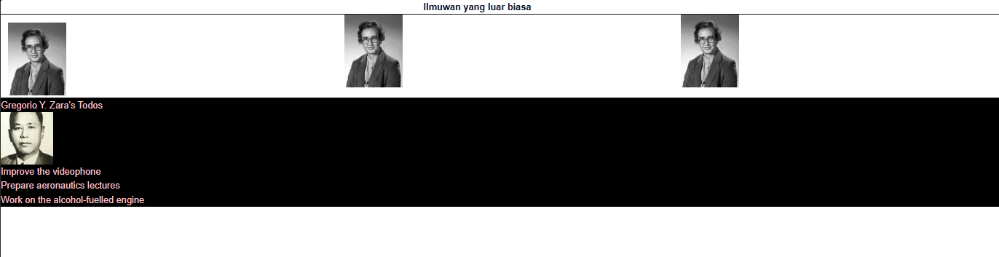

# Pemrograman Web Enterprise

## Modul 2 - Belajar Komponen React

### Soal 1 - Mendefinisikan Komponen

Pada praktikum ini saya membuat komponen `Profile` pada file `src/components/profile.tsx`. Komponen tersebut menggunakan `Image` dari Next.js untuk menampilkan gambar seorang ilmuwan.

Komponen `Profile` kemudian di-import ke dalam `src/app/page.tsx` dan digunakan sebanyak tiga kali pada halaman utama.

Dari praktikum ini saya mempelajari bahwa komponen React dapat dibuat secara terpisah lalu digunakan kembali pada bagian lain aplikasi. Dengan cara ini, kode menjadi lebih terstruktur dan tidak perlu menulis elemen yang sama berulang kali.

### Hasil Praktikum


Hasil akhir menampilkan judul **"Ilmuwan yang luar biasa"** dan tiga gambar yang berasal dari komponen `Profile`.


---

### Soal 2 - Mengimpor dan Mengekspor Komponen

Pada praktikum ini saya membuat komponen baru bernama `Gallery` pada file `src/components/gallery.tsx`.

Komponen `Gallery` mengimpor komponen `Profile`, kemudian menampilkan komponen tersebut sebanyak tiga kali. Setelah itu, komponen `Gallery` di-import ke `src/app/page.tsx` dan digunakan pada halaman utama.

Dari praktikum ini saya mempelajari cara memisahkan komponen React ke dalam file yang berbeda serta bagaimana proses `export` dan `import` digunakan agar suatu komponen dapat digunakan kembali oleh komponen lain.

Struktur komponen yang digunakan menjadi:

```text
Home
└── Gallery
    ├── Profile
    ├── Profile
    └── Profile
```


### Soal 3 - Memperbaiki Kode JSX

Pada soal ini terdapat kode JSX yang masih memiliki beberapa kesalahan sehingga tidak dapat dijalankan dengan benar.

Perbaikan yang dilakukan yaitu membungkus beberapa elemen menggunakan Fragment (`<>...</>`), mengubah atribut `class` menjadi `className`, menutup tag `<br>` menjadi `<br />`, serta memperbaiki urutan penutupan tag `<b>` dan `<i>`.

Dari soal ini saya memahami bahwa penulisan JSX lebih ketat dibandingkan HTML biasa. JSX hanya dapat mengembalikan satu parent element, seluruh tag harus ditutup, dan beberapa atribut HTML memiliki penulisan yang berbeda ketika digunakan pada React.

### Hasil Soal 3


---

### Soal 4 - Menggunakan JSX Dinamis

Pada soal ini saya membuat komponen `TodoList` yang menggunakan objek JavaScript `person` untuk menyimpan data nama dan tema tampilan.

Pada kode awal terdapat error pada bagian `{person}` karena `person` merupakan sebuah object dan tidak dapat langsung ditampilkan sebagai teks di JSX. Perbaikannya dilakukan dengan mengakses properti `name` menggunakan `{person.name}`.

Komponen juga menggunakan `person.theme` pada atribut `style` sehingga nilai `backgroundColor` dan `color` dari object dapat digunakan secara dinamis.

### Hasil Soal 4




---

### Soal 5 - Mengekstrak URL Gambar ke Object

Pada soal ini URL gambar yang sebelumnya ditulis langsung pada atribut `src` dipindahkan ke dalam object `person`.

Dengan menyimpan data gambar di dalam object, informasi yang berkaitan dengan seorang ilmuwan dapat dikelompokkan dalam satu tempat dan kemudian digunakan pada JSX melalui properti object.

Setelah perubahan dilakukan, tidak terdapat perbedaan pada tampilan halaman web. Gambar dan informasi yang ditampilkan tetap sama karena perubahan hanya dilakukan pada cara data disimpan dan diakses di dalam kode.

### Hasil Soal 5


---

### Soal 6 - Memperbaiki Atribut src

Pada soal ini atribut `src` pada gambar diperbaiki agar dapat menggunakan beberapa nilai JavaScript untuk membentuk URL gambar secara dinamis.

URL gambar dibentuk dari `baseUrl`, `imageId`, `imageSize`, dan ekstensi `.jpg`.

Perbaikan yang digunakan adalah:

```tsx
src={baseUrl + person.imageId + person.imageSize + ".jpg"}
```

Untuk memastikan perbaikan berhasil, nilai `imageSize` diubah dari `"s"` menjadi `"b"`. Setelah perubahan tersebut, ukuran gambar yang ditampilkan ikut berubah menjadi lebih besar.

Dari soal ini saya memahami bahwa nilai JavaScript pada atribut JSX harus ditulis menggunakan kurung kurawal `{}` agar ekspresinya dapat diproses.

### Hasil Soal 6


